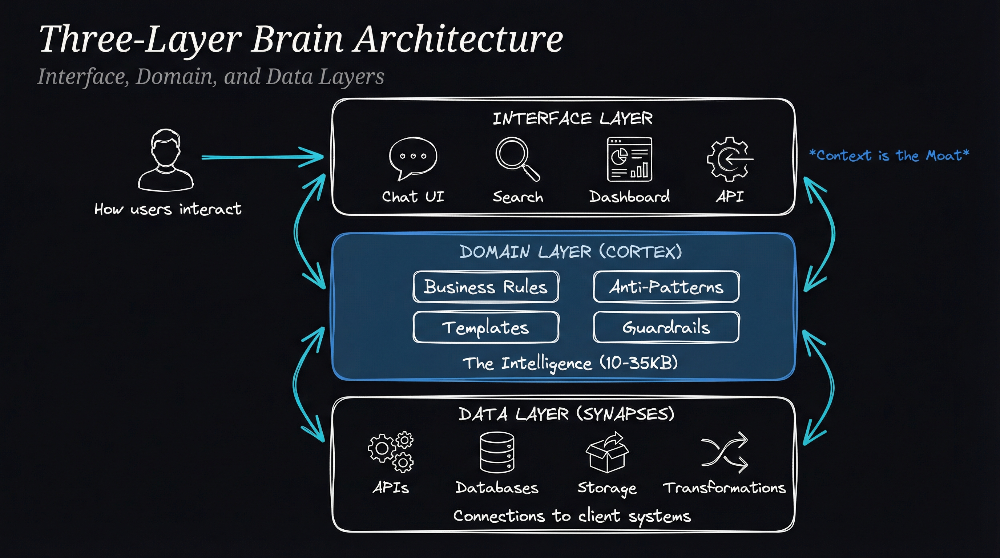
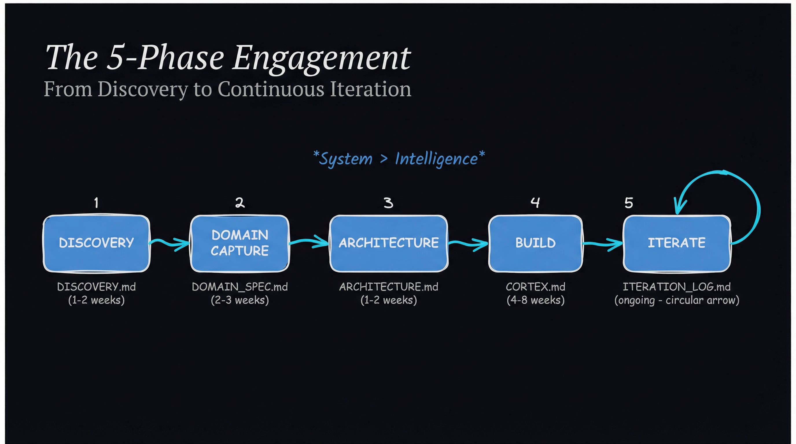
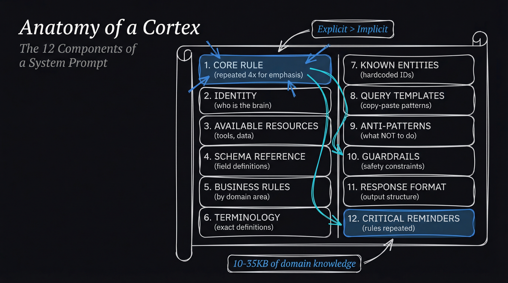
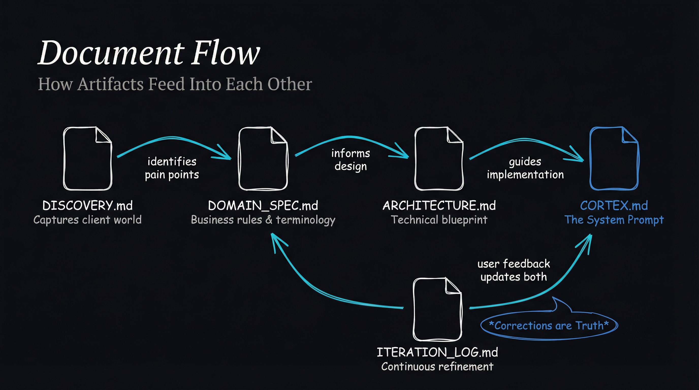
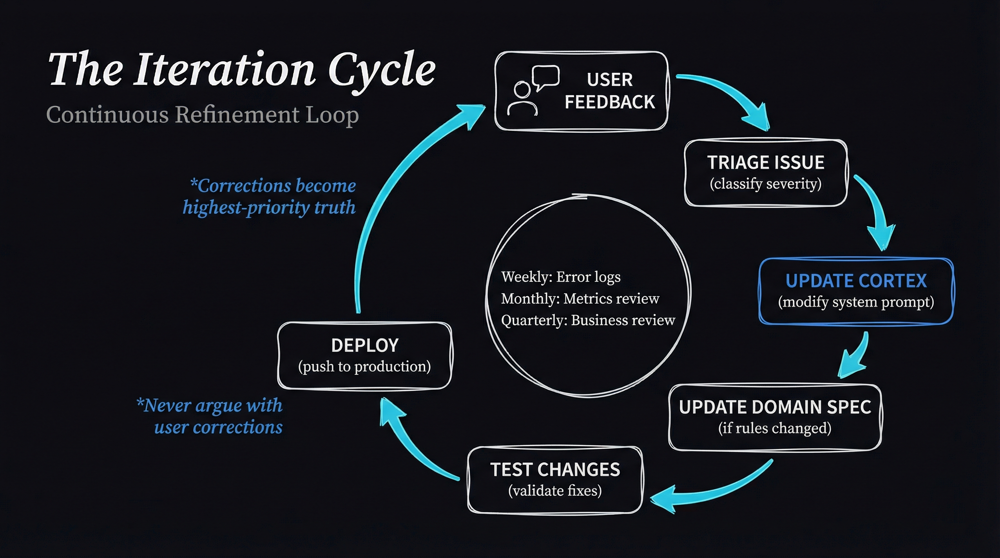

# WADL Brain Playbook

A complete methodology for building **intelligent systems that capture organizational knowledge and make it operational**.



---

## What This Is

We take:
- Tribal knowledge trapped in people's heads
- Business rules nobody wrote down
- Data scattered across systems
- Non-technical users waiting on IT for answers

And turn it into:
- Explicit rules encoded in system prompts
- Connected, queryable data layers
- Natural language interfaces anyone can use
- Systems that improve over time

**We're not in the AI chatbot business. We're in the organizational intelligence capture and operationalization business.**

---

## Quick Start

1. **Understand the methodology:** Read [`METHODOLOGY.md`](METHODOLOGY.md)
2. **Review pricing strategy:** Read [`PRICING_STRATEGY.md`](PRICING_STRATEGY.md)
3. **See a real example:** Read [`REFERENCE/PRIMULA_ANALYSIS.md`](REFERENCE/PRIMULA_ANALYSIS.md)
4. **Start a new project:** Use templates in [`TEMPLATES/`](TEMPLATES/)
5. **Track your progress:** Use checklists in [`CHECKLISTS/`](CHECKLISTS/)

---

## The Five Phases



| Phase | Question | Output |
|-------|----------|--------|
| 1. Discovery | What's the client's world? | `DISCOVERY.md` |
| 2. Domain Capture | What does the brain need to know? | `DOMAIN_SPEC.md` |
| 3. Architecture | How will the brain work? | `ARCHITECTURE.md` |
| 4. Build | Make it real | Working Brain + `CORTEX.md` |
| 5. Iterate | What's still wrong? | `ITERATION_LOG.md` |

---

## The Brain Stack

Every WADL Brain has three layers:

| Layer | Purpose | Contains |
|-------|---------|----------|
| **Interface** | How users interact | Chat UI, Search, Dashboard, API |
| **Domain (Cortex)** | The intelligence | Business rules, anti-patterns, templates, guardrails |
| **Data (Synapses)** | Connections to client systems | APIs, databases, transformations |

---

## The Cortex

The system prompt is the heart of the brain. A typical Cortex is 10-35KB of explicit domain knowledge.



**12 Components:**
1. Core Rule (repeated for emphasis)
2. Identity
3. Available Resources
4. Schema Reference
5. Business Rules
6. Terminology
7. Known Entities
8. Query Templates
9. Anti-Patterns
10. Guardrails
11. Response Format
12. Critical Reminders

---

## Document Flow



Each phase produces an artifact that feeds into the next:
- **Discovery** identifies pain points and opportunities
- **Domain Spec** captures all business rules and terminology
- **Architecture** designs the three-layer system
- **Cortex** encodes domain knowledge into the system prompt
- **Iteration Log** tracks continuous refinement

---

## The Iteration Cycle



Brains improve continuously through structured feedback loops:
- **Weekly:** Error log review
- **Monthly:** Metrics and status update
- **Quarterly:** Business review

*Corrections from users become highest-priority truth.*

---

## Core Principles

| Principle | Meaning |
|-----------|---------|
| **System > Intelligence** | Scaffolding matters more than model smarts |
| **Context is the Moat** | Deep context capture is the value |
| **Explicit > Implicit** | Write down what to do AND what not to do |
| **Code Before Prompts** | 80% deterministic, 20% AI |
| **Simplicity Saves** | Minimum viable complexity |
| **Corrections are Truth** | Never argue with user corrections |

---

## Repository Structure

```
Playbook/
├── README.md                 <- You are here
├── METHODOLOGY.md            <- The complete methodology
├── PRICING_STRATEGY.md       <- Value-based pricing framework
├── EVOLUTION.md              <- Tracks state, gaps, and changes
│
├── TEMPLATES/                <- Starting points for each artifact
│   ├── DISCOVERY.md
│   ├── DOMAIN_SPEC.md
│   ├── ARCHITECTURE.md
│   ├── CORTEX.md
│   └── ITERATION_LOG.md
│
├── CHECKLISTS/               <- Phase completion criteria
│   ├── PHASE_1_DISCOVERY.md
│   ├── PHASE_2_DOMAIN_CAPTURE.md
│   ├── PHASE_3_ARCHITECTURE.md
│   ├── PHASE_4_BUILD.md
│   └── PHASE_5_ITERATE.md
│
├── DIAGRAMS/                 <- Visual documentation
│   ├── 01-five-phase-flow.png
│   ├── 02-three-layer-architecture.png
│   ├── 03-cortex-anatomy.png
│   ├── 04-document-relationships.png
│   ├── 05-iteration-cycle.png
│   ├── 06-pricing-gap-analysis.png
│   └── 07-new-pricing-tiers.png
│
└── REFERENCE/                <- Real examples
    └── PRIMULA_ANALYSIS.md
```

---

## Using This Repository

### For a New Client

1. Copy `TEMPLATES/DISCOVERY.md` to client folder
2. Complete Phase 1 using `CHECKLISTS/PHASE_1_DISCOVERY.md`
3. Repeat for each phase
4. Reference `REFERENCE/PRIMULA_ANALYSIS.md` for guidance

### For Process Improvement

1. Review completed projects against checklists
2. Identify gaps in methodology
3. Update templates and checklists
4. Add to reference implementations

---

## License

MIT
